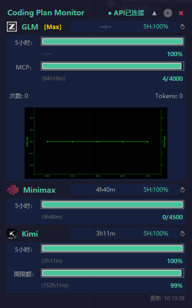
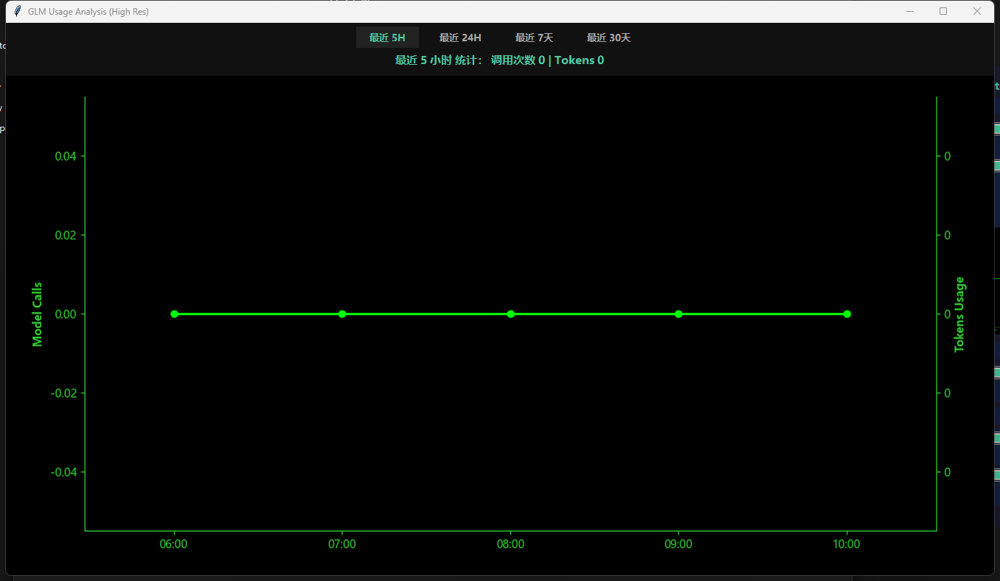
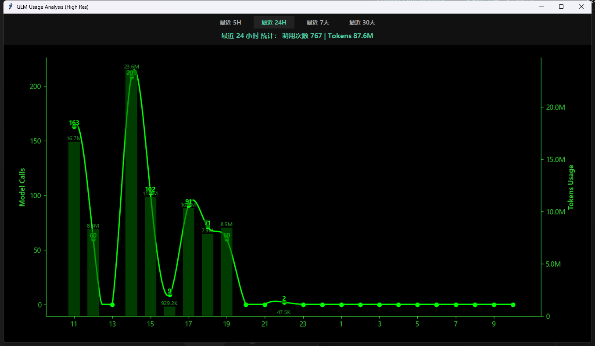
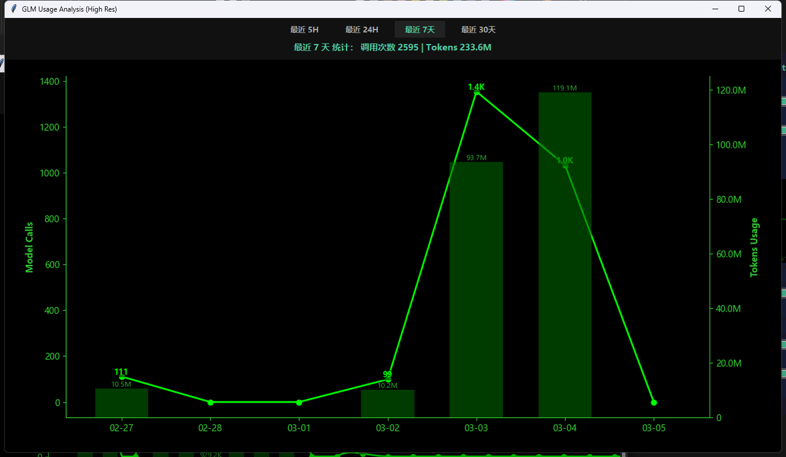
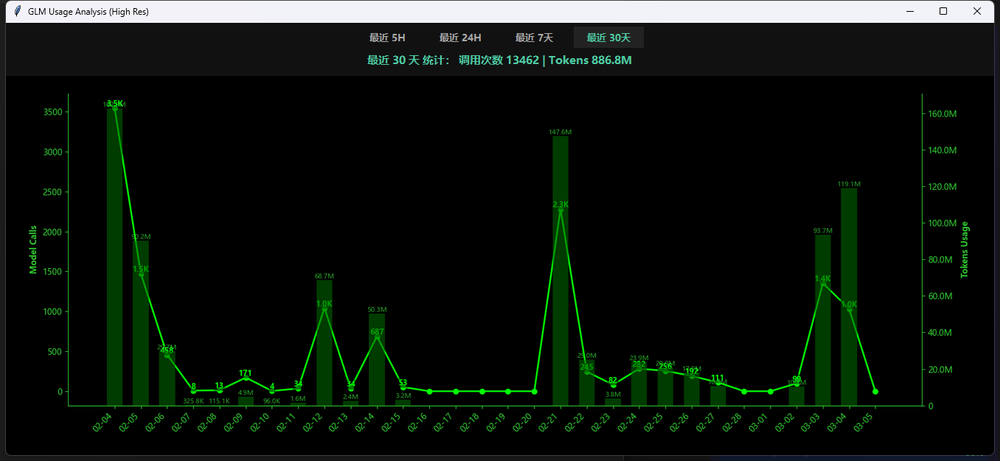
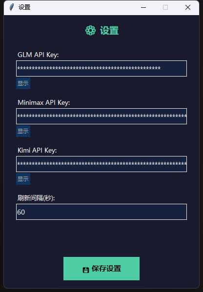
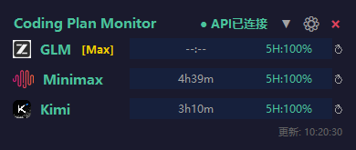

# Coding Plan Monitor (GLM / MiniMax / Kimi)

Windows 悬浮窗监控工具，用于实时显示多个 AI 编码计划 API 的配额使用情况。

## 核心功能

- **多模型支持**：同时监控 **智谱 GLM**、**MiniMax** 和 **Kimi (Moonshot)** 的编码计划配额。
- **实时指标**：
  - **GLM**: 5小时/周/MCP 配额百分比、重置倒计时、调用次数及 Token 统计。
  - **MiniMax**: 5小时配额百分比、重置倒计时。
  - **Kimi**: 5小时/周配额百分比、重置倒计时。
- **可视化图表**：双击 GLM 区域可查看 5H/24H/7D/30D 的模型调用分布趋势。
- **单例运行**：程序自动检测是否已运行，重复启动时会通过“窗口晃动”提醒并自动置顶。
- **系统托盘**：
  - 支持最小化到系统托盘。
  - 右键菜单：显示/隐藏窗口、窗口居中、退出程序。
  - 双击图标：快速唤起窗口。
- **精简模式**：点击标题栏按钮可切换紧凑模式，只保留核心标题行。
- **动态刷新**：根据数据变化自动调整刷新频率（活跃时 30s，空闲时 60s）。

## 安装

1. 安装依赖：
```bash
pip install -r requirements.txt
```

2. (可选) 如需渲染 GLM SVG Logo，请安装：
```bash
pip install svglib reportlab
```

## 配置

程序配置现已统一使用 `.env` 文件管理：

1. 复制示例配置文件：
```bash
copy .env.example .env
```

2. 编辑 `.env`，填入各平台的 API Key。

## 运行

直接运行主程序：
```bash
python CodingPlan_monitor.py
```

或双击使用 Windows 无窗口启动脚本：
```bash
start_monitor.bat
```

## 交互说明

- **左键拖动**：点击标题栏或背景可任意拖动窗口。
- **右键菜单**：右键点击窗口背景可快速进入设置或退出。
- **关闭按钮 (×)**：点击后程序隐藏至系统托盘，不会退出。
- **设置界面**：可直接在 UI 中修改 API Key 并实时生效。

## 数据存储

数据保存在项目根目录下的 `data/` 目录中：
- `glm/`: 智谱 API 原始数据及统计图表。
- `minimax/`: MiniMax 原始响应。
- `kimi/`: Kimi 原始响应及标准化摘要。

## 功能截图

以下是程序的主要功能和界面展示：

### 1. 主界面展示
包含 GLM、MiniMax 和 Kimi 的实时配额监控，显示 5 小时和周配额百分比。


### 2. 详细数据图表
双击模型区域可打开详细的使用量统计图表，支持 5H/24H/7D/30D 视图切换。





### 3. 设置界面
可在程序内直接配置各平台的 API Key 和全局刷新间隔。


### 4. 紧凑模式
点击标题栏折叠按钮可切换至精简视图，适合长期挂载在桌面边缘。


### 5. 系统托盘与右键菜单
支持最小化到托盘，右键菜单提供显示/隐藏、居中窗口及退出功能。


### 6. 单例运行提醒
重复启动程序时，已有窗口会通过“晃动”效果提醒用户，并自动置顶。


### 7. 刷新状态显示
标题栏实时显示 API 连接状态及数据刷新进度。


## 致谢与声明

在此特别感谢原项目 [wzx011011/glm-plan-monitor](https://github.com/wzx011011/glm-plan-monitor) 的作者。本项目是在该优秀开源项目的基础上进行的二次开发。

由于在原项目基础上进行了大量的架构重构、增加了多模型支持（MiniMax/Kimi）、单例运行提醒、系统托盘等诸多功能，改动跨度较大，故不再合并回原仓库，选择独立维护。再次对原作者提供的原始灵感和开源贡献表示诚挚的感谢！

## License

MIT
